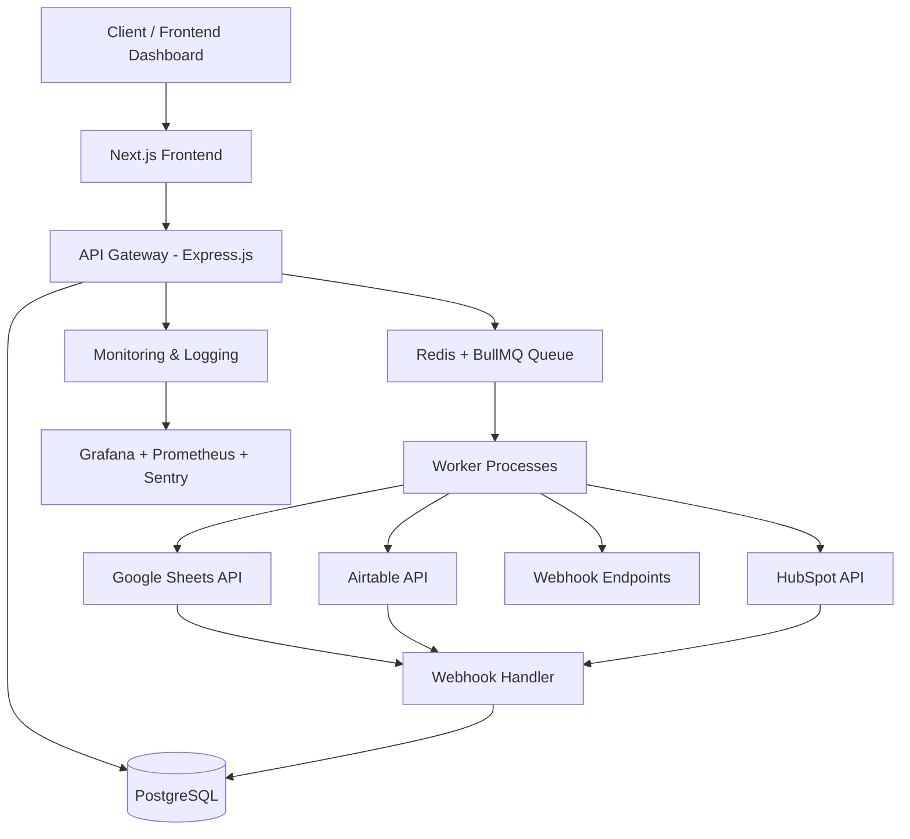

# 🚀 SyncBridge – Real-Time Data Synchronization Platform

---

# 📌 Overview

SyncBridge is a modern SaaS platform designed to synchronize data across multiple systems reliably, securely, and in real time.

Businesses today operate across dozens of disconnected tools:

- CRMs  
- Spreadsheets  
- Databases  
- Internal dashboards  
- Automation platforms  

Keeping those systems synchronized is often manual, unreliable, and difficult to scale.

SyncBridge solves this problem through a queue-driven integration architecture combined with a no-code pipeline builder, background workers, webhook orchestration, and enterprise-grade observability.

---

# 🎯 Problem Statement

Modern teams struggle with fragmented data across tools:

- Customer records become inconsistent  
- Reporting dashboards become outdated  
- API failures silently break workflows  
- Manual reconciliation wastes operational time  
- Existing automation tools focus on triggers rather than reliable synchronization  

As companies scale, these problems become operational bottlenecks.

---

# 💡 Solution

SyncBridge acts as a centralized synchronization engine that:

- Accepts data from one source  
- Distributes updates across multiple systems  
- Retries failed operations automatically  
- Prevents duplicate sync events using idempotency  
- Tracks every sync event through logs and monitoring dashboards  
- Maintains consistency using webhook feedback loops  

The platform abstracts complex backend infrastructure into an intuitive no-code experience.

---

# 🧱 High-Level Architecture

---

# 🔄 Core Workflow

## 1. Data Ingestion
- User creates or updates data through the API or dashboard
- Requests are validated using schema validation
- Records are persisted to the database

## 2. Queue Processing
- A synchronization job is added to BullMQ
- Jobs are processed asynchronously to keep APIs responsive

## 3. Multi-System Distribution
Workers distribute data to connected integrations such as:
- Google Sheets
- Airtable
- PostgreSQL
- HubSpot
- Webhooks

## 4. Retry & Fault Handling
If integrations fail:
- Exponential backoff retries are triggered
- Failed jobs move to dead-letter queues
- Errors are logged and surfaced to users

## 5. Webhook Synchronization
External systems send webhook updates back into SyncBridge:
- SyncBridge validates signatures
- Updates are processed idempotently
- Database state remains consistent across platforms

---

# ⚙️ Core Features

## 🔌 Multi-System Integration
Connect and synchronize data across multiple SaaS platforms.

## 🔁 Advanced Retry System
- Exponential backoff
- Dead-letter queues
- Failure recovery workflows

## ⚡ Asynchronous Processing
Heavy synchronization workloads run in background workers for high performance.

## 🔔 Real-Time Webhooks
Bi-directional updates between systems using secure webhooks.

## 📊 Monitoring & Observability
Track:
- Pipeline health
- Job execution
- Retry attempts
- Failure logs
- Performance metrics

## 🧠 Idempotent Synchronization
Prevents duplicate data creation during retries and webhook replays.

## 🛡️ Enterprise Security
- OAuth 2.0 integrations
- RBAC access control
- HMAC webhook verification
- AES-256 encryption
- Secure API key management

## 🧩 No-Code Pipeline Builder
Visual drag-and-drop interface for configuring synchronization pipelines.

---

# 🧠 Engineering Concepts Demonstrated

This project demonstrates real-world backend engineering concepts including:

- Distributed systems architecture  
- Queue-based processing  
- Background job orchestration  
- Fault tolerance & resilience  
- Event-driven architecture  
- API orchestration  
- Webhook infrastructure  
- Idempotency handling  
- Observability & monitoring  
- Multi-tenant SaaS architecture  
- Scalable worker systems  

---

# 🛠️ Tech Stack

## Frontend
- Next.js 14
- TypeScript
- Tailwind CSS
- shadcn/ui
- Zustand
- React Query

## Backend
- Node.js
- Express.js
- TypeScript

## Database
- PostgreSQL

## Queue & Caching
- Redis
- BullMQ

## Infrastructure
- AWS
- Docker
- Kubernetes (planned)
- GitHub Actions CI/CD
- Terraform

## Monitoring
- Grafana
- Prometheus
- Sentry

## Authentication
- Auth0
- OAuth 2.0

## Integrations
- Google Sheets API
- Airtable API
- HubSpot API
- Webhooks

---

# 📊 MVP Goals

The MVP is considered successful when it achieves:

- 100 paying customers within 90 days
- 99.5% sync reliability
- Pipeline setup time under 10 minutes
- NPS score above 45
- $15K MRR by Month 6

---

# 🧪 Testing Scenarios

## Reliability Testing
- Queue retry validation
- Dead-letter queue testing
- Concurrent job execution

## Integration Testing
- Google Sheets synchronization
- Airtable synchronization
- Webhook delivery validation

## Failure Simulation
- API downtime handling
- Rate limit recovery
- Partial sync failure testing

## Security Testing
- Webhook signature verification
- RBAC authorization checks
- API rate limiting validation

## Performance Testing
- High-volume sync events
- Worker concurrency stress testing
- Queue throughput benchmarking

---

# 📈 Future Roadmap

## Phase 1 — Foundation
- Core sync engine
- 5 launch integrations
- Monitoring dashboard
- Authentication & RBAC

## Phase 2 — Growth
- Team workspaces
- Advanced transformations
- Marketplace templates
- API builder

## Phase 3 — Scale
- Enterprise SSO/SAML
- Connector SDK
- SLA monitoring
- Multi-workspace organizations

## Phase 4 — Platform
- Connector marketplace
- AI-powered field mapping
- Embedded analytics
- Multi-region infrastructure

---

# 🌍 Target Use Cases

- CRM synchronization
- Revenue operations automation
- Marketing pipeline syncing
- Internal operations tooling
- Multi-platform reporting systems
- SaaS workflow orchestration
- Agency client integrations

---

# 📌 Engineering Philosophy

> “Every sync event should complete reliably, even when external systems fail.”

SyncBridge is designed around reliability-first engineering principles:

- APIs remain fast through asynchronous queues
- Every failure is observable
- Every job is retryable
- Every sync is idempotent
- External systems are treated as unreliable dependencies

---

# 🚀 Why This Project Matters

SyncBridge demonstrates the architecture patterns used in modern:

- Integration platforms  
- Workflow automation systems  
- Enterprise SaaS products  
- Distributed backend systems  
- Event-driven applications  

It reflects practical engineering challenges encountered in production systems handling synchronization, reliability, observability, and scale.

---

# 🧭 Conclusion

SyncBridge is more than a synchronization tool.

It is a scalable integration infrastructure platform built to handle the complexity of real-world distributed data systems while providing a simple experience for operations teams and businesses.

The project showcases strong backend engineering principles, scalable architecture design, and modern SaaS platform thinking suitable for production-grade systems.
